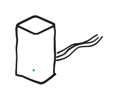
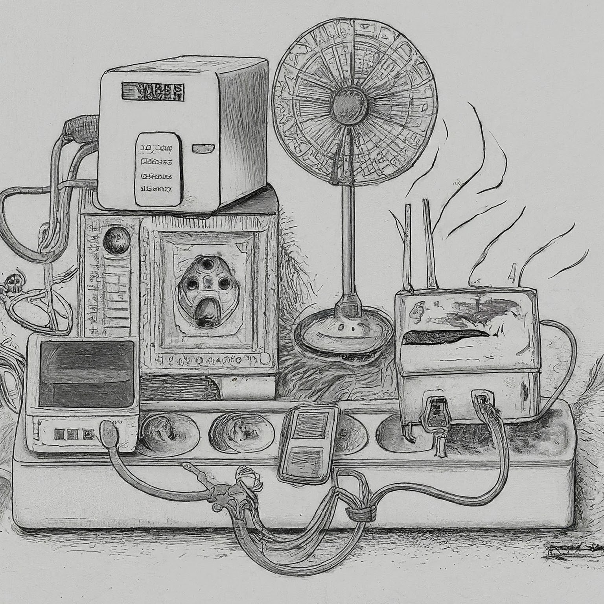

# OpenCapsule

## Plan:

### Phase 0 - Plan the Plan

* Spec it:
  * [actually quantify what is good about the AETC](AETC%20Features.md), and what we maybe don't need any more (or can't feasibly do in hardware)
  * Then pick some hardware and software (ideally already existing open things that do most of what we want)
* With the hardware and software known, plan the steps in the next 2 sections
  * Probably a high-level plan first, then more detail as the next two phases unfold

### Phase 1 - build it with off-the-shelf hardware, possibly not that prettily
* Phase 1a - **Software** (you are here)
  * do as much software implementation as possible with virtual hardware (which means it's sort-of still planning)
* Phase 1b - **POC hardware**
  * less expensive, modest performance hardware, probably a bit ugly
  * In fact quite possibly we might skip past it, or do it very minimally
* Phase 1c - "**Nicest we can do w.out custom hardware**"
  * Better performing hardware, that could maybe fit into a smallish DIY case, but no other custom hardware

### Phase 2 - DIY hardware
assuming Phase 1 went well, rustle up some custom hardware that is maybe as compact and elegant as the AETC, within reason. There could be all sorts of things here - custom breakout boards, custom PCB for a Pi CM or fully custom everything - but also there's a very real chance we'll happily decide not to go to this stage at all.

## Rationale

So what is the AETC and why do I need a modern one?

Maybe a picture sums it up best. Below is an artist's impression of two setups which contain an internet router, ethernet switch, Wifi AP, 3TB NAS (with Time Machine backup capability), with integrated DC power-supply for the whole setup and active cooling. On the left is the Apple way of doing that, on the right is everyone else's.

 

OK, it's a deranged AI hallucination (credit: Gemini), but hopefully you can see the point.

My AETC is in my lounge room, behind my TV, it's basically unnoticeable.

As well as being small, the AETC does quite a lot of farily advanced networking (if you want it to) with a very simple interface, there are only about 5 panes to the interface.

I've catalgued [all the AETC features](AETC%20Features.md)

But it does have *some* features that maybe we don't need anymore: you can connect a USB printer and it makes it into an airprint one - that sounds really hard to get right and my current printer has wifi. On the hardware side, the integrated power supply, in addition to requring work, would make this unsafe for non-qualified electricians to build.

## So the actual feature list is
* Internet gateway/router with NAT and PPPoE, confirgurable DHCP, port-forwarding (and whatever else is normal)
* Ethernet switch (TBH I only use the ports on the AETC cause some things are close enough. But it's a nice-to-have). 
* SMB NAS which can share USB drives of arbitrary size over the network and support Time Machine for macs (and the equivalent for other platforms)
* Wifi guest LAN (?) - I did use this for a while for kids' friends and tradespeople, but after one of those lengthy calls to your ISP where they wont help you unless you factory reset everything, I lost that setup and nobody's asked to get on our wifi since
* Not stupid expensive. I'm really not sure what that means here. Being an Apple thing, the AETC was a fair bit more than for other things, but amortised over its life, it's less than $50/yr

It's not that big when you look at it!

## Things we are NOT implementing
* The integrated power supply: I don't think it would be too hard, but you don't do anything with High Voltage in a hobby project. It's for the pros
* The print server - I think the number of non-wifi home printers out there is very small now
* 

## Plan - which hardware and software?
The obvious things seem to be a raspberry pi and OpenWrt - they can do the gateway and the NAS out-of-the-box, and I just need to add some ethernet ports to the pi (sadly I can't just get a small separate switch in cram it in as the Pi needs a separate LAN and WAN port)
